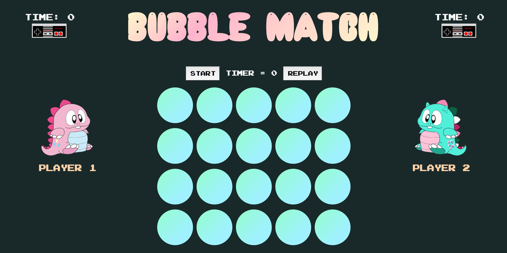
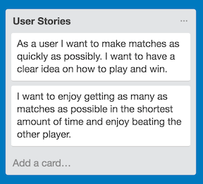
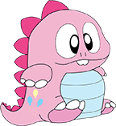
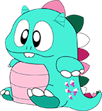

---

-

# <i>'Bubble Match'</i> is a super sweet memory matching challenge inspired by Taito's epic 1985 Nintendo game 'Bubble Bobble'.  Player 1 (Babs) & Player 2 (Bobby) are the children of Bub and his longtime girlfriend Betty.
--- 

## Directions:

<i>'Bubble Match'</i> is the epic battle to discover delicious ice cream and fruit hidden inside magical bubbles floating in happy space. The player who completes the matching challenge in shortest amount of time wins. Player 1 (Babs) begins their turn by pressing start, then commencing to click one bubble to reveal what's inside. 

A second click is then required to make a match. If matched, the prize remains revealed, if not, the magic bubble reforms. After matching and revealing all 10 fruit and ice cream prizes the final time is recorded. Player 2 (Bobby) presses start to begin their turn. When Player 2 completes matching, the winner is revealed!

Play <i>'Bubble Match'</i> <b><a href="http://bubblematch.ocean.town/">RIGHT HERE!</a></b>

## User stories:

## Development:

Built strong with HTML, CSS, JavaScript & jQuery.

Babs & Bobby by Rawdjur on DeviantArt:

 

## Dream features:
- Make it mobile responsive
- Add shuffling mechanism
- Create more levels

